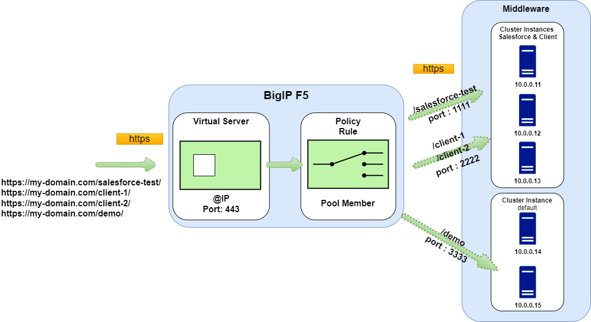
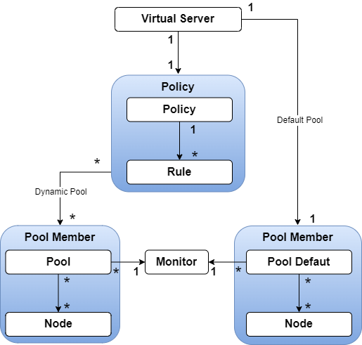

# How to create a dynamic Virtual IP through the load balancer F5 and Ansible

This Ansible playbook performs a Virtual IP creation or deletion for the load balancer F5.
See main file in the source code folder in order to launch the playbook : [main.yml](./code/tasks/main.yml) 

## Rules of the dynamic routing

The Virtual IP forwards the requests dynamically based on the root context of the URL.
 

## Hierarchical Objects view 

Below, the hierarchical view of the objects implied to handle the dynamic routing.

## References

- https://www.ansible.com/integrations/networks/f5
- https://docs.ansible.com/ansible/latest/collections/f5networks/f5_modules/index.html#plugins-in-f5networks-f5-modules
- https://github.com/ArtiomL/f5-ansible
